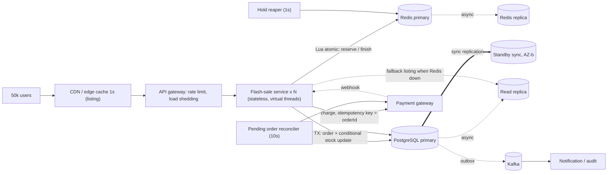

# Thiết kế hệ thống Flash Sale

Yêu cầu: 50k người dùng đồng thời, P95 đọc < 80ms, P95 ghi < 120ms, tuyệt đối không oversell, listing được phép trễ tối đa 2s, thanh toán phải chính xác.

## 0. Ý tưởng cốt lõi

Hệ thống chịu tải bằng cách **tách "chặn tải" khỏi "chốt sự thật"**:

1. **Redis là cổng admission.** Một counter `avail` được trừ bằng Lua nguyên tử. Hàng chục nghìn request thừa bị từ chối ở đây trong vài ms và không bao giờ chạm DB.
2. **PostgreSQL primary là nguồn sự thật.** Chỉ những request đã qua cổng (số lượng xấp xỉ tồn kho) mới ghi DB. Việc trừ kho là một câu `UPDATE ... WHERE stock >= qty`, nên dù Redis sai thì DB vẫn không thể oversell.
3. **Thanh toán nằm ngoài giao dịch DB**, dùng idempotency key và có reconciler dọn đơn treo.

Hệ quả quan trọng: **tải ghi lên DB bị chặn trên bởi lượng tồn kho (cộng một ít retry), không phụ thuộc vào 50k user.** Đây là điều làm P95 ghi < 120ms khả thi.

Ước lượng tải: 50k user poll listing mỗi 2s ≈ 25k rps đọc, được hấp thụ bởi CDN/cache cục bộ 500ms nên số lần đọc Redis chỉ cỡ `số instance × số sản phẩm × 2/s`. Add-to-cart có thể bùng nổ nhưng sau khi hết hàng mỗi request chỉ tốn một lệnh Lua O(1). Checkout tối đa bằng số hàng bán ra.

## 1. Phân loại PACELC

PACELC: khi có **P**artition thì chọn **A**vailability hay **C**onsistency; **E**lse (bình thường) thì chọn **L**atency hay **C**onsistency.

| Luồng | PACELC | Khi partition | Khi bình thường | Lý do |
|---|---|---|---|---|
| Listing stock | **PA/EL** | Vẫn trả số (cache cục bộ, hoặc replica), chấp nhận cũ | Ưu tiên latency: cache cục bộ 500ms, không bao giờ đọc primary | Được phép lệch 2s. Sai lệch chỉ ảnh hưởng hiển thị, không ảnh hưởng quyết định bán |
| Add-to-cart | **PC/EL** | Redis không với tới thì trả 503 (đóng cổng), không bán mù | Một hop Redis, Lua nguyên tử, không chờ đồng bộ cross-node | Giữ hàng phải không vượt tồn kho nên chọn C; nhưng phải nhanh nên không chờ replica |
| Checkout | **PC/EC** | Primary không có quorum đồng bộ thì từ chối ghi | Trả thêm latency (sync replica, khóa dòng, 2 giao dịch ngắn) để đổi lấy nhất quán | Tiền và tồn kho cuối cùng phải chính xác |

Lưu ý Redis: replication là bất đồng bộ nên khi failover có thể mất vài hold đã xác nhận. Đây là lý do cổng chỉ là lớp 1 và DB luôn là lớp chốt (mục 5, rủi ro 5).

## 2. Chọn DB và topology cho từng thành phần

| Thành phần | Lựa chọn | Topology | Vì sao |
|---|---|---|---|
| Tồn kho và đơn hàng (sự thật) | **PostgreSQL** | 1 primary + 1 standby đồng bộ (khác AZ) + 1-2 replica bất đồng bộ để đọc | ACID, `UPDATE` có điều kiện, unique index (chống mua trùng, chống xử lý trùng), khóa dòng. Chuyển tiền/đơn hàng cần giao dịch đa bảng |
| Cổng admission, hold | **Redis** | 1 primary + replica, Sentinel hoặc Cluster (hash tag `{productId}` để cùng slot) | Lua nguyên tử, sub-ms, hàng trăm nghìn ops/s |
| Cache listing | Cache cục bộ trong từng instance, thêm CDN micro-cache 1s ở edge | Không cần cluster riêng | Chặn thundering herd trước khi tới Redis |
| Sự kiện bất đồng bộ (mở rộng) | Kafka + Transactional Outbox | 3 broker | Thông báo, audit, analytics, không nằm trên đường găng |
| Thanh toán | Cổng thanh toán ngoài | Gọi idempotent, nhận webhook | Không tự giữ tiền |

Vì sao không chọn các phương án khác:

- **MySQL/InnoDB**: dùng được tương đương (cũng có `UPDATE` có điều kiện, nhưng index một phần như `uq_orders_user_product` phải mô phỏng bằng generated column). Chọn Postgres cho gọn.
- **Oracle**: RAC mạnh nhưng chi phí cao, không thêm đảm bảo nào mà bài toán này cần.
- **NoSQL (Cassandra/DynamoDB) làm nguồn sự thật**: quorum đọc/ghi không cho "kiểm tra rồi trừ" nguyên tử trên nhiều bản ghi. DynamoDB có conditional write nhưng một item nóng bị giới hạn thông lượng partition và khó làm giao dịch đơn hàng + tồn kho. Nếu muốn dùng thì chỉ hợp làm cổng admission thay Redis.

## 3. Kiến trúc



Luồng checkout (đường găng):

```mermaid
sequenceDiagram
    participant C as Client
    participant A as Service
    participant R as Redis
    participant P as Postgres primary
    participant G as Payment gateway

    C->>A: POST /cart/items
    A->>R: Lua reserve (avail -= qty, hold TTL)
    R-->>A: ok / sold out
    A-->>C: 201 / 409

    C->>A: POST /checkout (Idempotency-Key)
    A->>P: tìm order theo key (retry thì trả lại order cũ)
    A->>R: Lua beginCheckout (gia hạn hold)
    A->>P: TX: INSERT order PENDING; UPDATE stock WHERE stock >= qty
    P-->>A: commit (sync standby xác nhận)
    A-->>C: 202 Accepted (order PENDING)

    A->>G: charge(orderId)  (nền, ngoài TX)
    G-->>A: success / failure
    A->>P: UPDATE order WHERE status='PENDING' (PAID / FAILED + hoàn kho)
    A->>R: Lua finish (consume hold, hoặc hoàn avail nếu fail)
    C->>A: GET /orders/{id} (poll kết quả)
```

Vì sao checkout trả 202: thanh toán ngoài thường mất vài trăm ms, không thể nằm trong ngân sách P95 < 120ms. Phần "đặt chỗ và trừ kho" nhất quán và nhanh; phần "thu tiền" hoàn tất bất đồng bộ, chính xác nhờ idempotency và reconciler.

## 4. Cấu hình và knobs đề xuất

### 4.1 Đọc từ đâu

| Luồng | Đọc/ghi ở | Lý do |
|---|---|---|
| Listing | Cache cục bộ, Redis, rơi về async replica | Trễ chấp nhận được. Có thể đọc replica vì không dùng để quyết định |
| Add-to-cart | Redis primary | Quyết định giữ hàng cần giá trị mới nhất |
| Checkout | Postgres **primary** (không bao giờ replica) | Read-your-writes và kiểm tra tồn kho phải trên bản mới nhất |
| Xem đơn | Primary (hoặc cache theo đơn) | Người dùng vừa đặt phải thấy ngay đơn của mình |

### 4.2 PostgreSQL

| Knob | Giá trị | Tác dụng và đánh đổi |
|---|---|---|
| `synchronous_commit` | `on` cho checkout | Commit chỉ trả sau khi standby đồng bộ đã flush WAL, RPO = 0. Tốn thêm 1 vòng mạng giữa AZ |
| `synchronous_standby_names` | `ANY 1 (replica1, replica2)` | Quorum commit: chịu được mất 1 standby mà không dừng ghi. `FIRST 1 (...)` đơn giản hơn nhưng một standby chết là ghi treo |
| `remote_apply` (thay `on`) | Chỉ khi cần đọc sau ghi trên replica | Tăng latency, thường không cần vì checkout đọc primary |
| Replica bất đồng bộ | Cho listing fallback | Theo dõi lag. Quá 1s thì loại khỏi pool đọc (xem rủi ro 1) |
| `statement_timeout` / `lock_timeout` | ~100-200ms cho đường checkout | Không để request kẹt hàng chục giây trên khóa dòng |
| `idle_in_transaction_session_timeout` | ~2s | Chặn giao dịch bị bỏ quên giữ khóa |
| Pool (Hikari) / PgBouncer | 20-30 kết nối mỗi instance, hoặc PgBouncer transaction mode | Tránh bão kết nối. Tải ghi nhỏ nên pool nhỏ vẫn đủ |
| Chống hot row | Chia tồn kho thành N bucket (`stock_bucket`) khi một SKU vượt vài nghìn TPS | Khóa dòng của một SKU tuần tự hóa checkout; bucket cho song song |

### 4.3 Redis

| Knob | Giá trị | Tác dụng và đánh đổi |
|---|---|---|
| `appendonly yes`, `appendfsync everysec` | Bật | Mất tối đa ~1s dữ liệu nếu crash |
| `min-replicas-to-write 1` | Tùy chọn | Giảm mất hold khi failover nhưng ghi dừng nếu mất replica (nghiêng về C) |
| `maxmemory-policy noeviction` | Bắt buộc | Không để Redis tự xóa key cổng/hold |
| Timeout client | `timeout: 50ms` | Quá 50ms coi là lỗi, trả 503 thay vì kéo dài tail latency |
| Hash tag `{productId}` | Đã dùng | Các key của cùng một SKU nằm cùng slot khi dùng Cluster, Lua chạy được |

### 4.4 Ứng dụng

| Knob | Giá trị mặc định trong project |
|---|---|
| `spring.threads.virtual.enabled` | `true` (chịu nhiều kết nối đồng thời mà không phải cấu hình pool thread lớn) |
| `app.hold.ttl-seconds` | 120 (giữ hàng sau add-to-cart) |
| `app.hold.checkout-window-seconds` | 300 (gia hạn khi vào checkout) |
| `app.hold.max-qty-per-user` | 2 |
| `app.listing.cache-ms` | 500 (độ trễ tối đa hiển thị = 500ms + lag replica < 2s) |
| `app.payment.sync` | `false`: trả 202 ngay, giữ SLO ghi |
| Unique index `(user_id, product_id)` cho đơn PENDING/PAID | Mỗi user mua một lần, chống bot gom hàng |

## 5. Rủi ro và cách giảm thiểu

| # | Rủi ro | Hậu quả | Giảm thiểu |
|---|---|---|---|
| 1 | **Replication lag** | Listing hiện số cũ; nếu lỡ dùng replica để quyết định thì oversell | Replica chỉ phục vụ hiển thị. Mọi quyết định bán đọc Redis hoặc primary. Giám sát `pg_stat_replication` lag; quá ngưỡng thì loại replica khỏi pool. Cache cục bộ 500ms giữ tổng độ trễ < 2s |
| 2 | **Thundering herd** (mở sale, cache hết hạn đồng loạt, Redis restart) | Hàng chục nghìn request cùng đập Redis/DB | Single-flight theo sản phẩm (chỉ 1 request nạp lại), TTL có jitter, CDN micro-cache 1s, pre-warm trước giờ G, cổng từ chối nhanh khi hết hàng, rate limit/phòng chờ (waiting room) ở gateway |
| 3 | **Retry storm** | Client timeout rồi retry dồn dập làm quá tải thêm | Client dùng exponential backoff + jitter. Server trả `Retry-After`. Timeout ngắn và đồng nhất, circuit breaker, load shedding ở gateway, giới hạn ngân sách retry |
| 4 | **Idempotency** (retry tạo đơn hai lần, trừ tiền hai lần) | Trừ kho/tiền trùng | `Idempotency-Key` unique trên `orders`; retry trả lại đơn cũ. Cổng thanh toán nhận `orderId` làm idempotency key. Chuyển trạng thái bằng `UPDATE ... WHERE status='PENDING'` nên chỉ một bên thắng; hoàn kho chỉ khi thắng |
| 5 | **Redis failover mất hold** (replication bất đồng bộ) | Cổng cho qua nhiều hơn tồn kho thật | DB là chốt chặn: `UPDATE ... WHERE stock >= qty` nên không thể oversell; người dùng thừa sẽ nhận "hết hàng" ở checkout. Có test mô phỏng (`databaseStillPreventsOversellEvenIfRedisOvercounts`). Sau failover chạy lại đồng bộ `avail` từ DB (`POST /admin/products/{id}/stock`) |
| 6 | **Hold hết hạn đúng lúc đang thanh toán** | Hàng bị trả về cổng dù đơn đã PAID, cổng cho qua dư | Gia hạn hold khi `beginCheckout`. Phần dư (nếu có) vẫn bị DB chặn ở bước trừ kho |
| 7 | **Thanh toán không rõ kết quả** (timeout) | Có thể đã trừ tiền nhưng ta tưởng thất bại | Không bao giờ đánh FAILED khi không chắc: giữ PENDING. Reconciler gọi lại với cùng key để lấy kết quả thật rồi mới chốt |
| 8 | **Hot row** trên một SKU | Checkout xếp hàng sau khóa dòng | Khóa chỉ giữ từ lúc `UPDATE` tới commit (insert order chạy trước). Khi cần hơn nữa thì chia bucket tồn kho |
| 9 | **Standby đồng bộ chết** | `synchronous_commit=on` làm ghi treo | Dùng quorum `ANY 1` với ≥2 standby. Có runbook hạ về async có kiểm soát nếu mất tất cả standby |
| 10 | **Bot/gom hàng** | Người thật không mua được | Giới hạn số lượng mỗi user, unique `(user, product)`, rate limit theo user/IP, captcha ở gateway |
| 11 | **Redis chết hoàn toàn** | Không add-to-cart được | Đóng cổng (503 + `Retry-After`) thay vì bán mù; listing rơi về replica. Đây là lựa chọn C trong PC/EL |

## 6. Ánh xạ thiết kế vào code

| Thiết kế | Code |
|---|---|
| Listing PA/EL, single-flight, fallback replica | `stock/StockViewService`, `config/JdbcConfig` |
| Cổng Lua nguyên tử, hold, reaper | `stock/HoldStore`, `stock/HoldReaper` |
| Add-to-cart PC/EL | `cart/CartService` |
| Checkout 2 pha, idempotency, chống oversell | `checkout/CheckoutService`, `catalog/ProductRepository.tryDecrement`, `schema.sql` |
| Thanh toán idempotent | `payment/*` |
| Dọn đơn treo | `checkout/PendingOrderReconciler` |
| Lỗi Redis thành 503 | `error/ApiExceptionHandler` |
| Chứng minh không oversell | `OversellIntegrationTest` |
| Kiểm tra SLO | `loadtest/flashsale.js` |

## 7. Giới hạn của bản triển khai này

- Cổng thanh toán là giả lập trong bộ nhớ, chưa có webhook thật.
- Chưa có Kafka/outbox cho đơn hàng (đã có thiết kế ở mục 3).
- `AdminController` không có xác thực.
- Chưa chia bucket tồn kho; chưa có waiting room.
- Load test k6 chạy một máy tới vài nghìn VU; để tiến tới 50k cần chạy phân tán nhiều máy.
